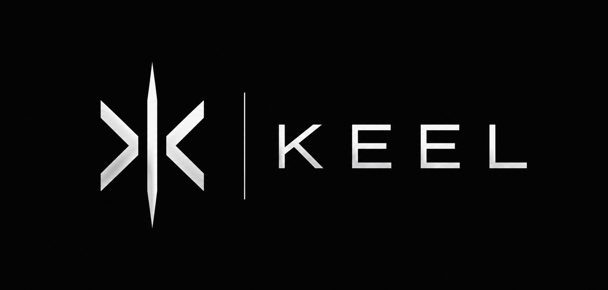
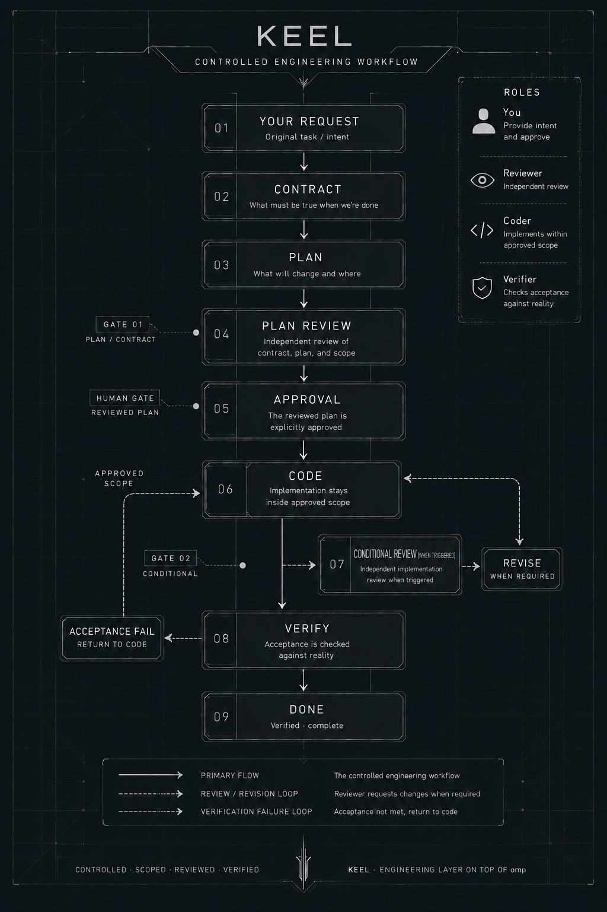
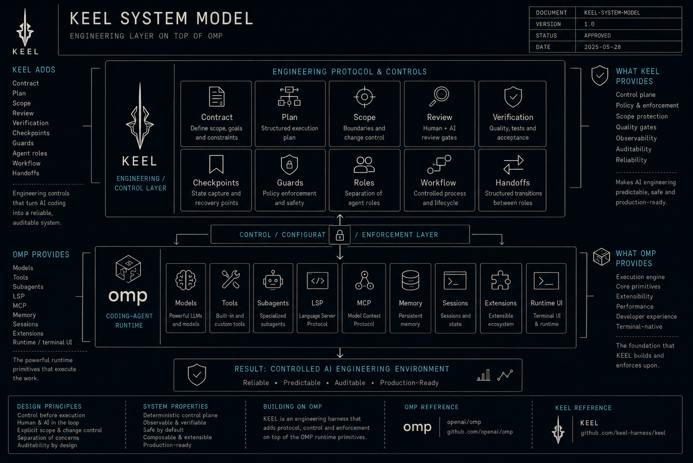
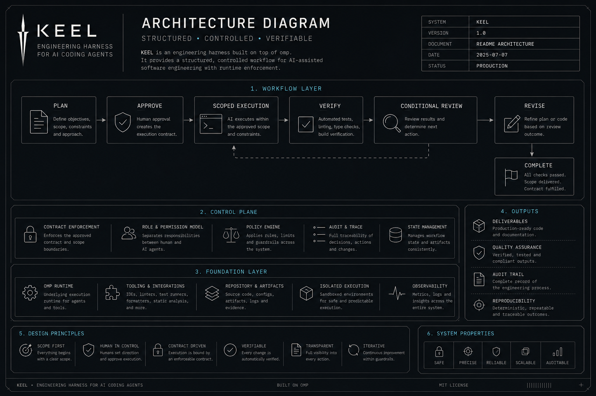
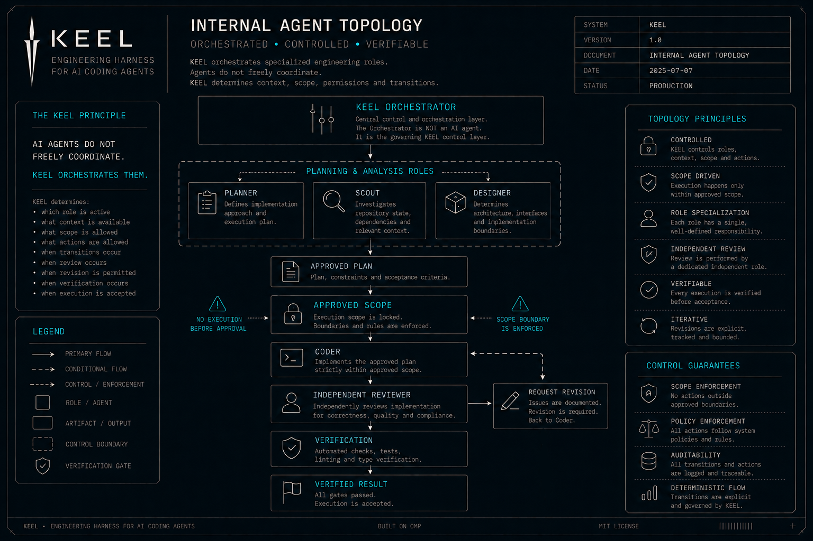

<div align="center">



# KEEL

### An engineering harness for AI coding agents

**Turn vague requests into planned, scoped, reviewed, and verified changes.**

KEEL is an opinionated layer on top of [omp](https://omp.sh/) that adds an engineering workflow around an AI coding agent: contracts, planning, scope control, independent review, live verification, checkpoints, and enforced handoffs.

[](https://omp.sh/)
[](LICENSE)

**[Quick Start](#quick-start)** · **[How It Works](#how-it-works)** · **[Architecture](#architecture)** · **[Visuals](#visuals)** · **[Documentation](#documentation)**

</div>

---

## The problem

AI coding agents are very good at writing code. The hard part is everything around the code:

- What exactly are we building?
- What is in scope — and what is not?
- Has the plan actually been reviewed?
- Did the agent change more than it was supposed to?
- Is the feature really working, or does the code merely look finished?
- What happens when context is compacted, restarted, or handed to another agent?

Most of these problems are handled with prompts and good intentions.

**KEEL handles them with a workflow and runtime enforcement.**

---

## What KEEL does

KEEL turns an AI coding session into a controlled engineering pipeline.



The implementation loop can run through multiple coder/reviewer iterations. The reviewer is not a mandatory post-code pass on every implementation: it re-enters after code when native checks fail repeatedly, behavior cannot be checked automatically, the diff is large, or a sensitive area changed. You only get pulled back in when a meaningful decision, approval, or real blocker requires you.

> **KEEL is not another coding agent. It is the engineering system around one.**

---

## Built on omp

KEEL **requires [omp](https://omp.sh/)**. It is not a fork of omp and does not replace it.

[omp](https://omp.sh/) provides the underlying coding-agent runtime: models, tools, subagents, LSP, memory, MCP, sessions, extensions, and the terminal UI.

KEEL adds the engineering layer on top.



### Why not build another agent?

Because omp already provides the primitives KEEL needs. KEEL deliberately stays thin: it configures those primitives, adds its own instruction layers and agents, and uses a runtime extension to enforce rules that should not be left to a model's memory.

**Upstream:** [omp.sh](https://omp.sh/) · [omp on GitHub](https://github.com/YanwuZeng/omp)

---

## Why KEEL is different

### A contract comes before implementation

The task becomes an explicit acceptance contract before the coder starts. Ambiguity is surfaced early instead of being silently converted into code.

### The plan is a real gate

The coder does not start just because the model thinks the plan is good enough. The plan is reviewed by a separate reviewer and then reaches an explicit human approval point.

### Scope is enforced

The approved plan defines the mutation scope. KEEL blocks changes outside that scope instead of merely asking the model not to make them.

### Roles are separated

The planner plans. The coder implements. The reviewer reviews. The orchestrator coordinates. A read-only scout gathers facts. Keeping responsibilities separate makes it harder for one model to talk itself into believing its own work is correct.

### "Done" requires evidence

The coder reports what was verified and what was not. The reviewer independently evaluates the plan and, when triggered, the implementation. Acceptance is tied to the contract rather than to the model saying "looks good".

### Verification can reach the real system

For UI work, the contract-bound implementation path can use browser-based tooling and require evidence from the running application instead of treating source code as proof that the UI works.

### The workflow survives context loss

Important state lives in project control documents and the harness, not only in one model's conversation history. Restarting or compacting a session does not have to erase the engineering process.

### Enforcement lives below the prompt layer

KEEL uses runtime guards for scope, write ownership, control-file protection, LSP write actions, agent topology, and incomplete acceptance.

---

## How It Works

KEEL adds a small set of cooperating roles around the primary omp session:

| Role | Responsibility | Writes project code? |
|---|---|---:|
| **Orchestrator** | Understands the request, coordinates the workflow, owns control documents | No |
| **Planner** | Produces the implementation plan and acceptance contract | No |
| **Coder** | Implements the approved work | **Yes** |
| **Reviewer** | Gates the plan before code and conditionally reviews the implementation | No |
| **Designer** | Produces UI/UX concepts when needed | No |
| **Scout** | Cheap, read-only codebase reconnaissance | No |

The roles use omp's native subagent and tool mechanisms. KEEL adds its own rules, skills, and runtime extension to enforce the boundaries between them.

---

## Architecture

The important distinction is that **review happens twice, for different reasons**: Gate #1 is a pre-code review of the contract and plan; Gate #2 is a conditional post-code review of the implementation. The second gate is not run on every implementation pass.



The internal role topology is documented separately:



The primary session owns the control documents. The coder is the only role intended to write project code. Planner, designer, and scout are strictly read-only; the reviewer has no project write tools and no browser/MCP tools in its declared tool set. Browser-based UI verification belongs to the contract-bound implementation path when `visual-tooling` is injected.

---


## Enforcement, not just prompts

A central design principle of KEEL is:

> **If a rule matters, do not rely on the model remembering it.**

The harness includes guards for things such as:

- plan approval before coding;
- primary-session code fencing;
- pre-change checkpoints;
- mandatory contracts before implementation/review;
- scope locking;
- read-only agent enforcement;
- controlled agent-spawn topology;
- single-writer sequencing;
- protection of KEEL control files from subagents;
- blocking LSP mutation actions outside the coder;
- review-to-coder handoff without paraphrasing;
- acceptance checks before a task can be considered complete.

These mechanisms complement omp's native permissions and tool boundaries. They are not intended to replace them.

---

## Quick Start

### 1. Clone KEEL

```bash
git clone https://github.com/maxoxon/KEEL.git
cd KEEL
```

### 2. Run the installer

macOS / Linux / Git Bash:

```bash
./install.sh
```

Windows PowerShell:

```powershell
./install.ps1
```

**The installer checks for `omp`. If it is not installed, it installs the official omp distribution first.** KEEL is then installed into omp's agent configuration directory.

If you already have omp installed, the installer leaves it alone.

### 3. Configure models

Open:

```text
~/.omp/agent/config.yml
```

Replace the `KEEL_SETUP_REQUIRED` placeholders with the model IDs you want for each role.

The coder model is configured separately in:

```text
~/.omp/agent/agents/coder.md
```

The coder and reviewer should use models that reliably support the strict structured-output schemas required by KEEL.

### 4. Verify the installation

```bash
./verify.sh
```

Windows:

```powershell
./verify.ps1
```

The verification scripts inspect the installed files directly and do not require an LLM. A successful installation should report **0 failed** checks.

### 5. Start omp

```bash
omp
```

Then give the orchestrator a task in natural language.

For the full workflow, see **[docs/USAGE.md](docs/USAGE.md)**.

---

## Installation model

KEEL installs as an **omp configuration layer**, not as a separate binary.

The installer places files under:

```text
~/.omp/agent/
├── AGENTS.md
├── APPEND_SYSTEM.md
├── RULES.md
├── config.yml
├── models.yml
├── mcp.json
├── extensions/
│   └── keel.ts
├── agents/
│   ├── planner.md
│   ├── reviewer.md
│   ├── coder.md
│   ├── designer.md
│   └── scout.md
└── skills/
    └── ...
```

Existing files are not silently overwritten. If you already customized omp, the installer tells you which files need to be merged manually.

For detailed installation and configuration, see **[docs/INSTALL.md](docs/INSTALL.md)**.

---

## The four-stage mental model

You do not need to understand every internal file to use KEEL.

### 1. Understand

What exactly do you want? What constraints matter? What does success look like?

### 2. Plan

Where should the change happen? What is explicitly out of scope? How will it be verified?

### 3. Execute

The coder implements only the approved work. Review and implementation can iterate without constantly interrupting you.

### 4. Prove

The result is checked against the contract. For UI and integration work, verification can use the real running system.

---

## What KEEL does not promise

KEEL cannot verify requirements that were never defined.

If the contract says "add a button" but never says what the button should do, no harness can magically know the missing requirement.

KEEL therefore focuses on making **explicit requirements hard to lose and hard to ignore**. The quality of the initial requirement still matters.

---

## When KEEL is useful

KEEL is most useful when an AI agent is doing work that you care about getting **correct**, not merely generated:

- multi-file features;
- UI changes that need real browser verification;
- bug fixes where the root cause matters;
- refactors where behavior must remain unchanged;
- architecture changes;
- tasks where scope creep is expensive;
- long-running sessions with multiple agents;
- anyone who wants a repeatable engineering process around AI coding.

For a trivial one-line change, KEEL may be more process than you need. That's intentional.

---

## Documentation

| Document | Purpose |
|---|---|
| **[docs/USAGE.md](docs/USAGE.md)** | Day-to-day workflow and how to give KEEL tasks |
| **[docs/INSTALL.md](docs/INSTALL.md)** | Installation, model configuration, verification, and troubleshooting |
| **[docs/ARCHITECTURE.md](docs/ARCHITECTURE.md)** | Deep dive into the harness, state machine, agent topology, guards, scope enforcement, structured output, recovery, and extension model |
| **[docs/DEVELOPMENT.md](docs/DEVELOPMENT.md)** | Safe changes to the harness and maintainer workflow |
| **[docs/MANIFEST.md](docs/MANIFEST.md)** | Current inventory of agents, skills, instructions, configuration, and guards |
| **`agent/`** | The actual KEEL harness files installed into omp |

If you are new to KEEL:

**README → [docs/INSTALL.md](docs/INSTALL.md) → [docs/USAGE.md](docs/USAGE.md)**

If you are auditing or developing KEEL:

**[docs/ARCHITECTURE.md](docs/ARCHITECTURE.md) → [docs/MANIFEST.md](docs/MANIFEST.md) → `agent/` source → `verify.*` / `tests/`**

---

## Relationship to omp

KEEL is intentionally dependent on omp's runtime and APIs. It can therefore be affected by changes in omp's agent model, configuration schema, tool permissions, extension API, and subagent behavior.

When something appears to be an omp capability rather than a KEEL rule, check the upstream project first:

**[omp — official project](https://omp.sh/)**

KEEL does not try to duplicate omp's documentation. This repository documents the engineering layer KEEL adds on top.

---

## License

KEEL is released under the [MIT License](LICENSE).

<div align="center">

**KEEL — make the agent follow the engineering process, not just the prompt.**

</div>
